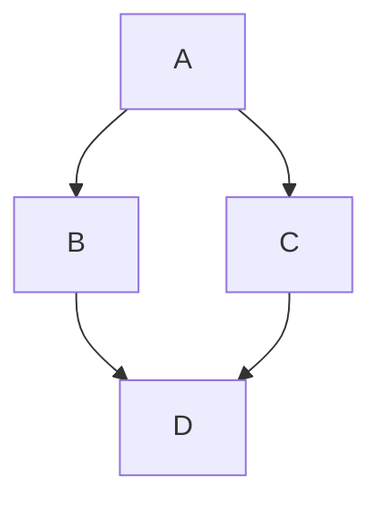

# Create a Page

Add **Markdown or React** files to `src/pages` to create a **standalone page**:

- `src/pages/index.js` → `localhost:3000/`
- `src/pages/foo.md` → `localhost:3000/foo`
- `src/pages/foo/bar.js` → `localhost:3000/foo/bar`

## Create your first React Page {/* #create-your-first-react-page */}

Create a file at `src/pages/my-react-page.js`:

```jsx title="src/pages/my-react-page.js"
import React from "react";
import Layout from "@theme/Layout";

export default function MyReactPage() {
  return (
    <Layout>
      <h1>My React page</h1>
      <p>This is a React page</p>
    </Layout>
  );
}
```

A new page is now available at [http://localhost:3000/my-react-page](http://localhost:3000/my-react-page).

## Create your first Markdown Page {/* #create-your-first-markdown-page */}

Create a file at `src/pages/my-markdown-page.md`:

```mdx title="src/pages/my-markdown-page.md"
# My Markdown page

This is a Markdown page
```

A new page is now available at [http://localhost:3000/my-markdown-page](http://localhost:3000/my-markdown-page).

## Example Mermaid diagram {/* #example-mermaid-diagram */}



## Add Math {/* #add-math */}

- https://docusaurus.io/docs/markdown-features/math-equations

Let $f\colon[a,b]\to\R$ be Riemann integrable. Let $F\colon[a,b]\to\R$ be
$F(x)=\int_\{a\}^\{x\} f(t)\,dt$. Then $F$ is continuous, and at all $x$ such that
$f$ is continuous at $x$, $F$ is differentiable at $x$ with $F'(x)=f(x)$.

$$
I = \int_0^\{2\pi\} \sin(x)\,dx
$$

Let $f : [a, b] \to \mathbb{R}$ be Riemann integrable.
Let $F : [a, b] \to \mathbb{R}$ be $F(x) = \int_{a}^{x} f(t) \, dt$.

Then $F$ is continuous, and at all $x$ such that $f$ is continuous at $x$,
$F$ is differentiable at $x$ with $F'(x) = f(x)$.

$$I = \int_{0}^{2\pi} \sin(x) \, dx$$
